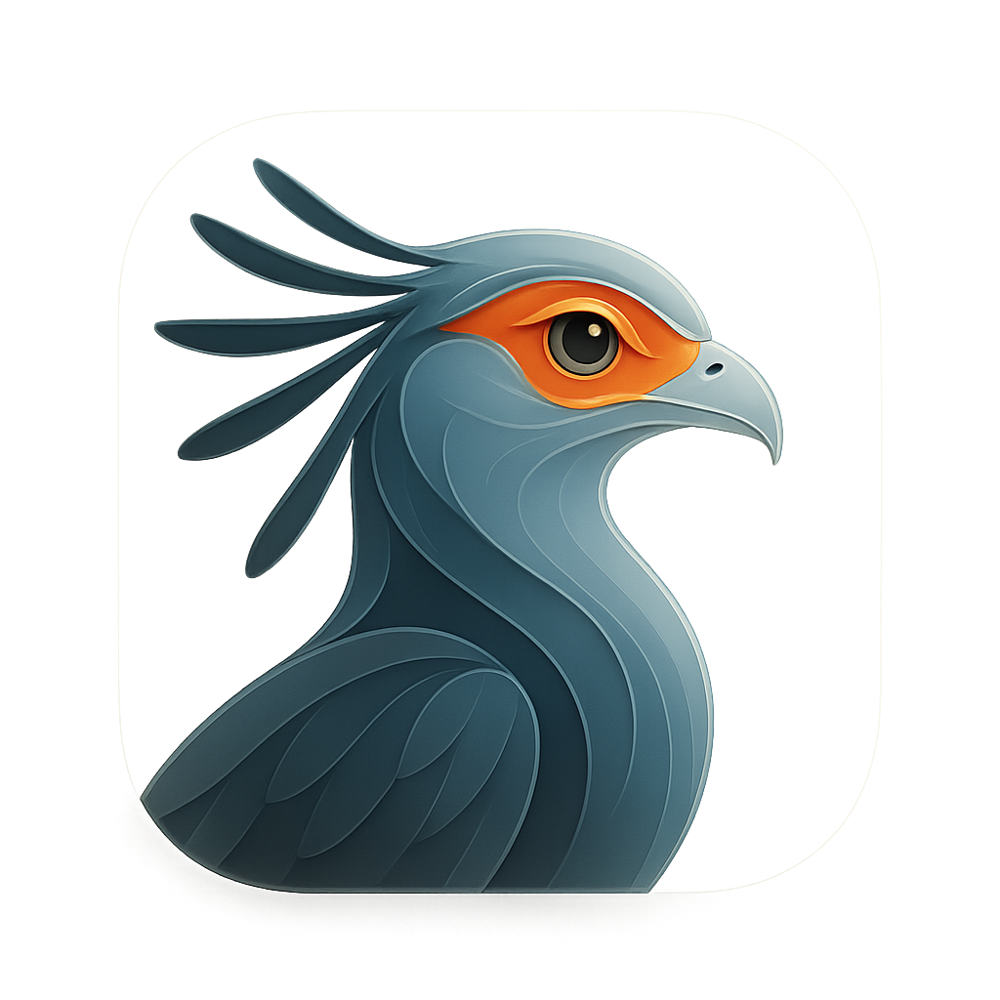
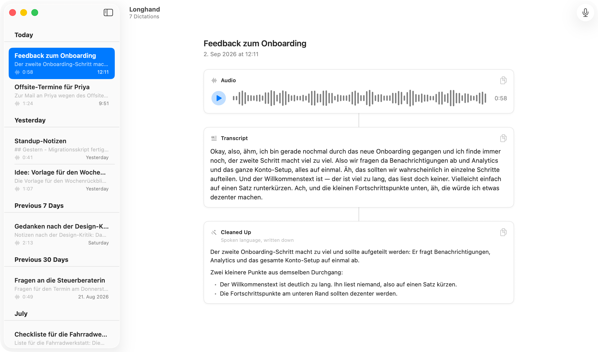

<p align="center">
  
</p>

# Longhand

[](https://github.com/marsvogel/Longhand/actions/workflows/build.yml)
[](#requirements)
[](AI_DISCLOSURE.md)
[](LICENSE)

Longhand is a macOS dictation app. You speak, Whisper transcribes the recording on your Mac, and Claude rewrites the transcript into written language. Each dictation keeps all three: the audio, the transcript, and the rewrite.

Press ⌘R to record, ⌘R again to stop.

<p align="center">
  <picture>
    <source media="(prefers-color-scheme: dark)" srcset="docs/hero-dark.png">
    
  </picture>
</p>

## Requirements

- macOS 26 or later, on an Apple silicon Mac
- A microphone
- [Claude Code](https://claude.com/claude-code), installed and signed in. Longhand runs the rewrite through your local `claude` binary.
- 2.8 GB of disk space for the transcription model

## First launch

Longhand downloads Whisper `large-v3-turbo` from Hugging Face to `~/Library/Application Support/Longhand/Models`: 1.6 GB of ggml weights and a 1.2 GB Core ML encoder. You can record while it downloads. Those recordings transcribe as soon as the model is ready.

macOS asks for microphone access the first time you record.

Speech recognition is fixed to German. To change it, edit the language string in `WhisperTranscriber.runInference`.

## Privacy

Recordings, transcripts, and rewrites stay in `~/Library/Application Support/Longhand`. There's no analytics and no account.

The rewrite is the only step that sends text off your Mac. The transcript goes to the Anthropic API through your local `claude` CLI, under your own Claude subscription. The audio never leaves the machine.

Longhand runs `claude` without tools, MCP servers, slash commands, user settings, or session persistence. The transcript arrives on stdin as data, not as instructions.

## Build from source

```sh
xcodebuild -project Longhand.xcodeproj -scheme Longhand -configuration Release build
```

The app builds to DerivedData. To build into the project folder instead, add `-derivedDataPath build`. No Apple Developer account is needed: the project signs to run locally.

Longhand isn't sandboxed, because it launches `claude` from your PATH.

## About the name

Shorthand is what you take down while someone speaks. Longhand is what you turn it into.

## Contributing

Longhand is small on purpose, and it stays that way. Bug fixes and prompt improvements are welcome; new features usually aren't. [CONTRIBUTING.md](CONTRIBUTING.md) says what gets merged, how to build the project, and why there is no test suite.

Stuck on something instead? [SUPPORT.md](SUPPORT.md) points you at the right place.

Found a security issue? Don't open an issue — [report it privately](https://github.com/marsvogel/Longhand/security/advisories/new). [SECURITY.md](SECURITY.md) describes the threat model.

Everyone taking part follows the [Code of Conduct](CODE_OF_CONDUCT.md). Longhand is built with AI coding tools; [AI_DISCLOSURE.md](AI_DISCLOSURE.md) says exactly how.

## License

Longhand is released under the [MIT License](LICENSE).

It stands on two pieces of work, both MIT-licensed:

- [whisper.cpp](https://github.com/ggml-org/whisper.cpp) by the ggml authors, which runs the transcription
- [Whisper](https://github.com/openai/whisper) by OpenAI, whose `large-v3-turbo` weights it downloads

Their license texts are in [NOTICE](NOTICE).
